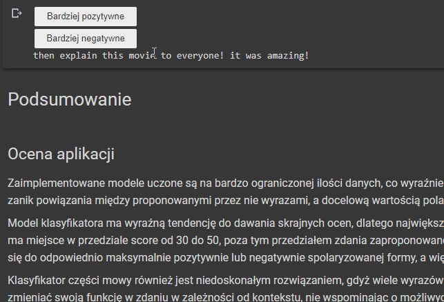
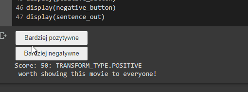
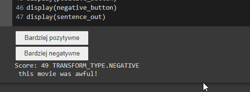

# Przetwarzanie nastroju w tekście

Aplikacja, która stosunkowo płynnie zmienia nastrój tekstu z negatywnego na pozytywny i na odwrót.
Ponadto omówiony został obecny *(Maj 2021)* stan rozwoju modeli przetwarzania języka naturalnego.

Z racji sporej konsupcji zasobów dyskowych,
sugeruję korzystanie z aplikacji za pomocą serwisu **Google Colab**.

Wykorzystany został model BERT poddany operacji *fine-tune* oraz wiele innych narzędzi.

---
### Przykładowe wyniki:

